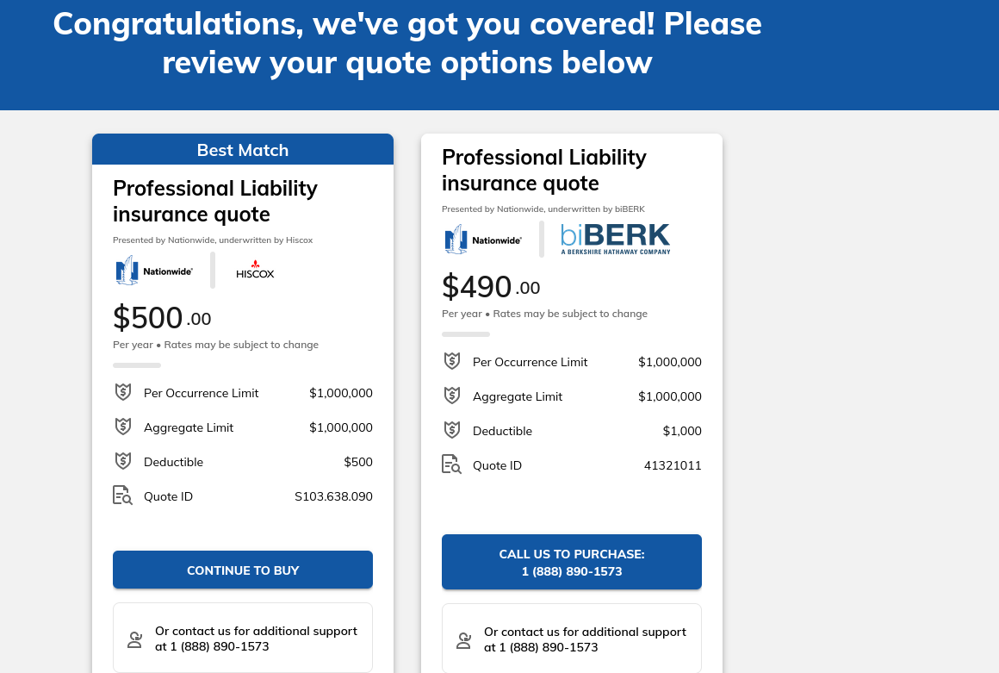

# Meeting Agenda

**Date:**  2024-02-03
**Time:**   2pm
**Location:**   discord

## Attendees:   
- Bob
- James
- Josh

## 1120-C: Taxes

**Presenter:** Bob

- Follow up on action item.
- Action Item (BOB Due Feb 3rd ) ask Crystal if she'd review a completed 1120-c, and how much it would cost CCS in dollar amount.

**Expected Outcome:** If Crystal said yes, what is the hourly rate? and a quote? do members agree to take on this cost, and to file taxes in this way?

Hourly Rate: $200/hr
Bob: Aye
James: Aye
Josh: Not present
Kelly: Not present
Garret: Not present

## E&O: Errors and Omissions "professional liability" insurance

**Presenter:** James

 

**Expected Outcome:** 

- vote 1: purchase E&O
Josh: Aye
James: Aye
Bob: Aye
Kelly: Not present
Garret: Not present

- vote 2.a: send out the E&O operating expense to members split evenly?
Bob: No
James: Present
Josh: Not present
Kelly: Not present
Garret: Not present

- vote 2.b: increase the monthly dues to cover the cost of General Liability and E&O policies? 
Bob: Aye
James: Aye
Josh: Not present
Kelly: Not present
Garret: Not present

## Additional Items for Discussion:

## Next Steps:

- Action Item ( from Jan-20th ) ( ALL Due NO LATER Than by March 16th meeting ) https://boiefiling.fincen.gov/boir/html
- Action Item ( James by Feb 12) purchase E&O through Hartford
- Action Item ( Everyone Feb 17) complete vote for 2.a and 2.b
- Action Item ( James by Mar 2 ) complete the 1120-C draft, to be reviewed by Crystal ( roughly 2 hours to review )
- Action Item: Put up for vote: Increasing monthly dues to $40 to cover E&O, liability, infrastructure costs see expenses spreadsheet in google docs.

## Next Meeting:

- Feb 17th @2pm Central - discord
