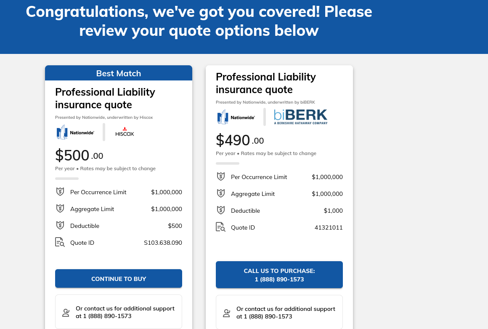

# Meeting Agenda

**Date:**  2024-02-17
**Time:**   2pm
**Location:**   discord

## Attendees:   

- Josh

NOTE: These meeting notes will contain hints of sarcasm but are mostly earnest

## 1120-C: Taxes

**Presenter:** Josh

- Not sure what is going on with Taxes, hopefully nothing bad.

**Expected Outcome:** n/a

## E&O: Errors and Omissions "professional liability" insurance

**Presenter:** Josh

 

$500 per year quoted seems reasonable to Josh

We each pay $15 per month currently in dues. We have four people paying dues currently (James, Bob, Kelly, Josh) which is $60 per month. There are monthly expenditures that need to be indexed.

$500 / 12 = rounding up $42, divided by 4 is $10.50.

I propose raising the dues by $10.50 to cover the insurance fees.

Or, we all pay $100 this month to cover 1 year of insurance

## Additional Items for Discussion:

## Next Steps:

- Action Item ( by March 2nd ) vote on either increasing dues by $10.50 to $25.50 or each paying $100 this month for insurance

Action items from last meeting not addresses:

- Action Item ( from Jan-20th ) ( ALL Due NO LATER Than by March 16th meeting ) https://boiefiling.fincen.gov/boir/html
- Action Item ( James by Feb 12) purchase E&O through Hartford
- Action Item ( Everyone Feb 17) complete vote for 2.a and 2.b
- Action Item ( James by Mar 2 ) complete the 1120-C draft, to be reviewed by Crystal ( roughly 2 hours to review )
- Action Item: Put up for vote: Increasing monthly dues to $40 to cover E&O, liability, infrastructure costs see expenses spreadsheet in google docs.

## Next Meeting:

- March 2nd @2pm Central - discord
