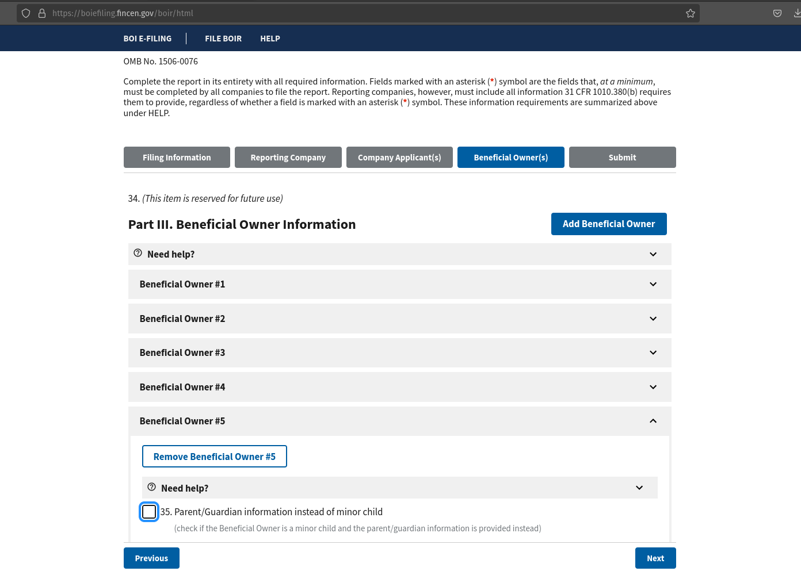
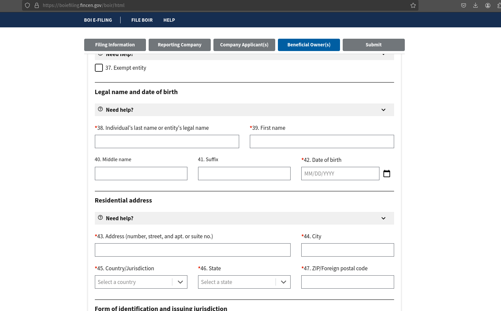
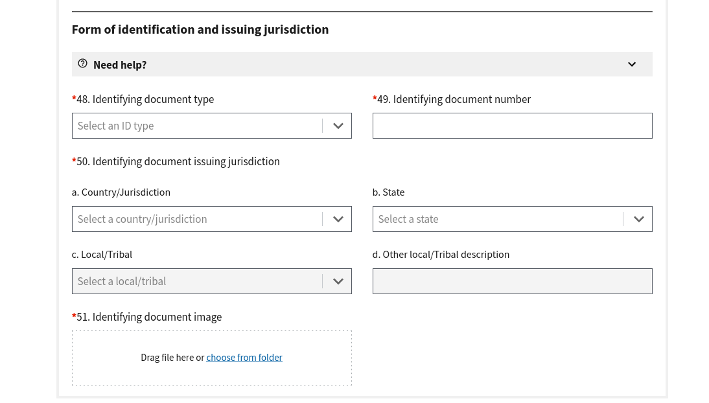

# Meeting Agenda

**Date:**  2024-03-02
**Time:**   2pm
**Location:**   discord

## Attendees:   
- Bob
- Kelly
- James
- Josh
- Emily

# Reminders

- Action Item ( from Jan-20th ) ( ALL Due NO LATER Than by March 16th meeting ) https://boiefiling.fincen.gov/boir/html
- Action Item: Put up for vote: Increasing monthly dues to $37.52 to cover E&O, liability, infrastructure costs see expenses spreadsheet in google docs.

## Increasing Dues / Paying for operating expenses

See the expenses breakdown spreadsheet for 2023: https://docs.google.com/spreadsheets/d/1gbhLgoYIaY8gEDxAfTEsvSTgU0QlCxjXHQ7HMBPi-Gk/edit#gid=0

- Option A: contract safari participants pay for E&O from their contract earnings as part of operating delegated to Secretary Treasurers discretion, increased dues for General Liability, infrastructure, and tax review. 
    Dues increased to $26.68 per member.
Bob:
James:
Josh:
Kelly:
Garret: Not present

- Option B: send out extra operating expense to members split evenly before time of payment:
    Dues stay at $15, extra operating expenses billed to each member upon receipt.
Bob:
James:
Josh:
Kelly:
Garret: Not present

- Option C: increase the monthly dues to cover the cost of General Liability, E&O policies, infrastructure, licenses, tax review 
    Dues increased to: $37.52
Bob:
James:
Josh:
Kelly:
Garret: Not present

## 1120-C: Taxes

**Presenter:** Bob

The 1120 C was completed for review on Feb 12th by James: https://discord.com/channels/1111646437894262844/1116107254068936765/1206671116400205835
- Action Item (BOB Due Mar ? ): pass the 1120-C for Crystal to review, at Bob's suggested rate of $200/hour

**Expected Outcome:** Review by Crystal, at the hourly rate of $200/hr based on what Bob said the price was from previous meeting.
Hourly Rate: $200/hr
Bob:
James:
Josh:
Kelly:
Garret: Not present

## Additional Items for Discussion:

- Emily introduction, sending out an application for membership.
- Asking William Bausman if he'd be open to a PT apprenticeship to setup GCloud Functions, and/or Zapier flows at $100 per zap, and/or gcloud javascript using the serverless framework.
- Veridomo Update: James contracted out an experiment, and the original idea is not feasible due to anti-bot detection on most/all of the major DNS providers.

## Next Steps:

- Action Item: All members will need to DM their PII to complete the FinCen BOI:

 
 

## Next Meeting:

- Mar 16 @2pm Central - discord
